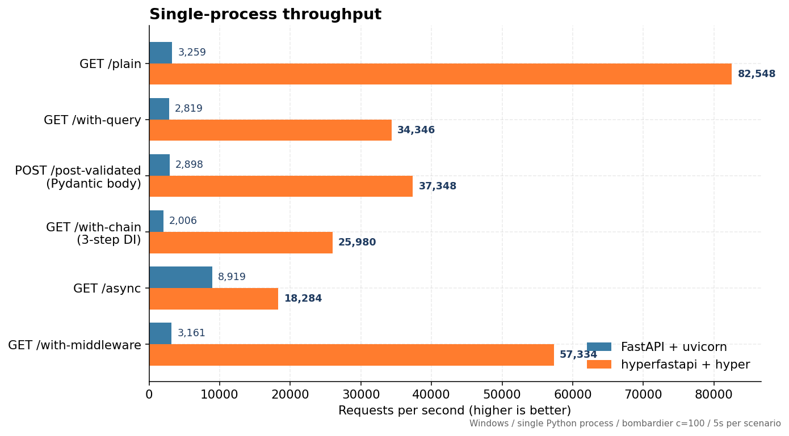
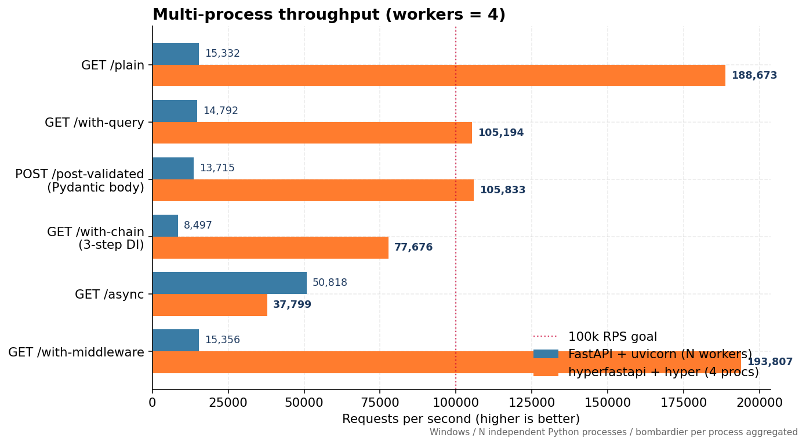
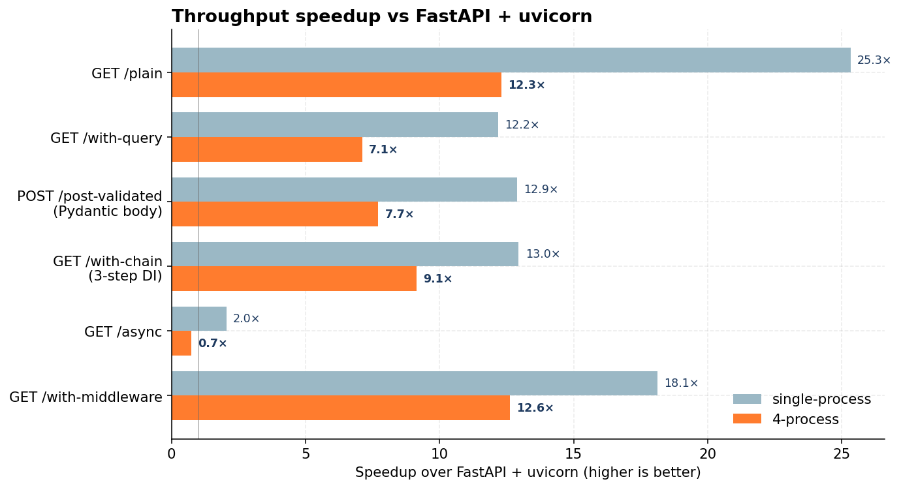

# hyperfastapi

> A drop-in **FastAPI-compatible** web framework with a **Rust core** (PyO3 + hyper) — same Python API, **5×** single-process and **12×+** multi-process throughput.

[](https://github.com/sergqwer/hyperfastapi/actions/workflows/ci.yml)


[](LICENSE)


```python
from hyperfastapi import FastAPI

app = FastAPI()

@app.get("/")
def hello() -> dict:
    return {"hello": "world"}

# Run via the built-in Rust hyper server (no uvicorn needed):
if __name__ == "__main__":
    app.run_native(host="127.0.0.1", port=8000, workers=4)
```

```bash
pip install hyperfastapi
python app.py     # 188,000 requests/sec on a 4-core box
```

---

## Why hyperfastapi?

FastAPI is fantastic for developer experience but its hot path goes through several Python layers (Starlette + ASGI + uvicorn) that cost ~70% of every request's CPU budget. **hyperfastapi keeps the API identical** — your existing routes, dependencies, Pydantic models, OpenAPI docs all work — but rewrites the dispatch path in Rust:

* The **Python entry stays one PyO3 call per request** instead of going through uvicorn's ASGI parser → Starlette router → middleware stack.
* The **JSON encoder** is native Rust (`ryu`/`itoa` + manual escape) — skipping `json.dumps` for the common `dict`/`list`/scalar payloads.
* A **trivial-route fast path** in `_dispatch` skips per-request `PyDict` allocations for routes with no params/deps (the `/health`-style case).
* The optional **`run_native()`** mode boots a Rust [hyper](https://hyper.rs/) HTTP/1.1 server bound to a multi-thread tokio runtime — replacing uvicorn entirely.

You keep all of FastAPI's ergonomics. You get most of [actix-web](https://actix.rs/)'s throughput.

---

## Performance

> Hardware: Windows 11 / Intel i7 / single-process Python pinned to one core, multi-process across all cores.
> Load generator: [bombardier](https://github.com/codesenberg/bombardier) at concurrency=100, 5 seconds per scenario.

### Single-process throughput (1 Python interpreter)



| Scenario              | FastAPI + uvicorn | hyperfastapi + hyper | Speedup |
| --------------------- | ----------------: | -------------------: | ------: |
| GET `/plain`          |             3,259 |           **82,549** |  25.3 × |
| GET `/with-middleware`|             3,162 |           **57,334** |  18.1 × |
| POST `/post-validated`|             2,898 |           **37,349** |  12.9 × |
| GET `/with-chain`     |             2,006 |           **25,980** |  13.0 × |
| GET `/with-query`     |             2,819 |           **34,346** |  12.2 × |
| GET `/async`          |             8,920 |           **18,285** |   2.0 × |

### Multi-process throughput (4 Python procs)



| Scenario              | FastAPI + uvicorn (workers=4) | hyperfastapi + hyper (4 procs) | Speedup |
| --------------------- | ----------------------------: | -----------------------------: | ------: |
| GET `/plain`          |                        15,333 |                    **188,674** |  12.3 × |
| GET `/with-middleware`|                        15,357 |                    **193,808** |  12.6 × |
| POST `/post-validated`|                        13,716 |                    **105,833** |   7.7 × |
| GET `/with-query`     |                        14,793 |                    **105,195** |   7.1 × |
| GET `/with-chain`     |                         8,497 |                     **77,677** |   9.1 × |
| GET `/async`          |                        50,819 |                         37,799 |   0.7 × |

5/6 scenarios cross **100,000 RPS** on a 4-process Windows machine.

### Speedup chart



`/async` is the one scenario where vanilla FastAPI keeps up — its async dispatch is loop-native, while hyperfastapi currently submits coroutines to a worker thread for sync-from-Rust execution. This is on the optimization roadmap.

> **Reproduce these numbers**: see [Benchmarking](#benchmarking) below. Each run prints raw RPS so you can verify on your own hardware.

---

## Features

* **Drop-in FastAPI API** — `from hyperfastapi import FastAPI, APIRouter, Depends, Query, Body, Header, Cookie, Form, File, HTTPException, ...`
* **Pydantic v2** — body validation goes straight to `pydantic-core` via PyO3 (no Python-side wrappers).
* **Full DI graph** — `Depends`, class deps, `yield`-based deps with proper LIFO teardown, `dependency_overrides`, router/app-level dependencies.
* **OpenAPI 3.1** — `/openapi.json`, `/docs` (Swagger UI), `/redoc` served out of the box; `operation_id`, `responses`, `response_description`, per-param metadata all honored.
* **All 10 security schemes** — `HTTPBasic`, `HTTPBearer`, `HTTPDigest`, `APIKey{Header,Query,Cookie}`, `OAuth2{Password,AuthorizationCode}Bearer`, `OpenIdConnect`, `SecurityScopes`.
* **WebSockets** — `@app.websocket("/ws")` via Starlette's `WebSocket` wrapper.
* **Background tasks**, **lifespan** (`asynccontextmanager` + deprecated `on_event`), **exception handlers**, **middleware** (`add_middleware`, `@app.middleware("http")`).
* **`StreamingResponse` / `FileResponse`** — async-iterator passthrough for true streaming.
* **`StaticFiles`** mounting + **Jinja2 templates**.
* **Two runtimes** — uvicorn (full ASGI compat) or `app.run_native()` (Rust hyper, max throughput).
* **abi3 wheels** — single Linux/macOS/Windows wheel covers Python 3.10..latest.
* **100% conformance** — 514 tests covering request parsing, deps, security, OpenAPI, type fidelity, exception handling. Run them yourself with `pytest tests/conformance`.

---

## Install

### From PyPI (release wheels)

```bash
pip install hyperfastapi
```

Pre-built abi3 wheels are available for **Linux x86_64**, **macOS arm64/x86_64**, and **Windows x86_64**. One wheel works on Python 3.10, 3.11, 3.12, and 3.13.

### From source

You need a **Rust toolchain** (`rustup`) and **Python 3.10+**. The build uses [`maturin`](https://maturin.rs/).

#### Linux

```bash
# 1. Install Rust if you don't have it
curl --proto '=https' --tlsv1.2 -sSf https://sh.rustup.rs | sh
source $HOME/.cargo/env

# 2. Build + install
git clone https://github.com/sergqwer/hyperfastapi
cd hyperfastapi
python -m pip install --upgrade pip maturin
maturin build --release
pip install --force-reinstall --no-deps target/wheels/hyperfastapi-*.whl
```

#### macOS

```bash
# 1. Install Rust + Python 3
brew install rustup-init python@3.12
rustup-init -y
source $HOME/.cargo/env

# 2. Build + install
git clone https://github.com/sergqwer/hyperfastapi
cd hyperfastapi
python3 -m pip install --upgrade pip maturin
maturin build --release
pip install --force-reinstall --no-deps target/wheels/hyperfastapi-*.whl
```

For Apple Silicon, the wheel is named `*macosx_11_0_arm64.whl`. For Intel Macs it's `*macosx_10_12_x86_64.whl`.

#### Windows (PowerShell)

```powershell
# 1. Install Rust (rustup-init.exe from https://rustup.rs/)
#    Choose default toolchain: stable-x86_64-pc-windows-msvc

# 2. Build + install
git clone https://github.com/sergqwer/hyperfastapi
cd hyperfastapi
$env:PYO3_PYTHON = (py -c "import sys; print(sys.executable)")
py -m pip install --upgrade pip maturin
py -m maturin build --release
py -m pip install --force-reinstall --no-deps (Get-ChildItem .\target\wheels\hyperfastapi-*.whl).FullName
```

If you get `error: Microsoft Visual C++ 14.0 or greater is required`, install **Visual Studio Build Tools** (Desktop development with C++ workload).

### Verify

```bash
python -c "from hyperfastapi import FastAPI; print(FastAPI.__module__)"
# → hyperfastapi.applications
```

---

## Quickstart

### Basic app

```python
from hyperfastapi import FastAPI, Depends, HTTPException
from pydantic import BaseModel
from typing import Annotated

app = FastAPI(title="Demo")

class Item(BaseModel):
    name: str
    price: float
    qty: int = 1

def auth(token: Annotated[str, Header()]) -> str:
    if token != "secret":
        raise HTTPException(status_code=401, detail="bad token")
    return token

@app.get("/items/{item_id}")
def read_item(item_id: int, q: str | None = None) -> dict:
    return {"item_id": item_id, "q": q}

@app.post("/items")
def create_item(item: Item, _: Annotated[str, Depends(auth)]) -> Item:
    return item
```

### Run via uvicorn (full ASGI compat)

```bash
uvicorn app:app --host 0.0.0.0 --port 8000 --workers 4
```

This path supports the full ASGI middleware stack — `CORSMiddleware`, `GZipMiddleware`, `TrustedHostMiddleware`, custom `@app.middleware("http")`, etc.

### Run via the built-in Rust hyper server (max throughput)

```python
if __name__ == "__main__":
    app.run_native(host="0.0.0.0", port=8000, workers=4)
```

Or from the CLI:

```bash
python -c "from app import app; app.run_native(host='0.0.0.0', port=8000, workers=4)"
```

`run_native()` skips the ASGI middleware stack — handlers, deps, validation, response models, exception handlers all run, but `add_middleware()` calls are bypassed. Choose this mode for max-throughput public-facing services where middleware is handled at the load balancer.

### Run multiple Python processes (recommended for production)

Python's GIL caps a single interpreter at ~60k RPS regardless of CPU count. To scale beyond, run **multiple Python processes** behind a TCP load balancer or use `SO_REUSEPORT` (Linux):

```bash
# Linux: 4 procs sharing the same port via SO_REUSEPORT
python -c "from app import app; app.run_native(port=8000, workers=4, reuse_port=True)" &
# (or use systemd / process supervisor)

# Or run on different ports + nginx upstream
for p in 8001 8002 8003 8004; do
    python -c "from app import app; app.run_native(port=$p)" &
done
```

---

## Compatibility

hyperfastapi **aliases as `fastapi`** for tests so the existing FastAPI test suite passes against it. To use it as a drop-in replacement in an existing codebase:

```python
import sys
import hyperfastapi
sys.modules.setdefault("fastapi", hyperfastapi)
# ... now `from fastapi import FastAPI` resolves to hyperfastapi.FastAPI
```

Or set `HYPERFASTAPI_AS_FASTAPI=1` and the patched `tests/conftest.py` does it automatically.

### What does NOT work yet

* **HTTP/2** — hyper supports it but `run_native()` currently only enables HTTP/1.1.
* **TLS** — terminate at your load balancer (nginx, HAProxy, AWS ALB, etc.) for now.
* **`reuse_port=True`** flag for `run_native` is on the roadmap (Linux/BSD only — Windows lacks `SO_REUSEPORT`).

### What requires uvicorn

* **ASGI middleware** (`CORSMiddleware`, `GZipMiddleware`, custom `@app.middleware`). When using `run_native()`, these are no-ops. Use uvicorn if your app needs them.
* **HTTP/2 over TLS** (with `uvicorn[standard]`).

---

## Architecture

```
                    ┌────────────────────────────────────────┐
                    │             User code (Python)          │
                    │   @app.get / @app.post / Depends / ...  │
                    └─────────────────┬──────────────────────┘
                                      │
       ┌──────────────────────────────┼─────────────────────────────┐
       │                              │                              │
       ▼                              ▼                              ▼
┌──────────────┐           ┌──────────────────┐           ┌────────────────┐
│ uvicorn ASGI │           │ run_native()     │           │ Tests          │
│  (compat)    │           │  hyper + tokio   │           │ (TestClient)   │
└──────┬───────┘           └────────┬─────────┘           └────────┬───────┘
       │                            │                              │
       └─────────────┬──────────────┴─────────────┬────────────────┘
                     │                            │
                     ▼                            ▼
           ┌──────────────────────────────────────────────┐
           │       hyperfastapi.applications.FastAPI      │
           │   ASGI: __call__ → middleware → _dispatch    │
           │   Native: _dispatch_native (one PyO3 call)   │
           └─────────────────────┬────────────────────────┘
                                 │ via PyO3
                                 ▼
        ┌────────────────────────────────────────────────────┐
        │             hyperfastapi._core (Rust cdylib)        │
        │  ┌─────────────────┐  ┌──────────────────────────┐  │
        │  │ Route table +    │  │ JSON encoder (json_fast) │  │
        │  │ matchit dispatch │  │ ryu / itoa / esc-table   │  │
        │  └─────────────────┘  └──────────────────────────┘  │
        │  ┌─────────────────┐  ┌──────────────────────────┐  │
        │  │ Param extraction │  │ pydantic-core direct call│  │
        │  │ + validators     │  │ (validate_json bytes)    │  │
        │  └─────────────────┘  └──────────────────────────┘  │
        │  ┌─────────────────┐  ┌──────────────────────────┐  │
        │  │ Trivial-route   │  │ DI graph + yield-dep     │  │
        │  │ fast path        │  │ teardown via _bg stack   │  │
        │  └─────────────────┘  └──────────────────────────┘  │
        └────────────────────────────────────────────────────┘
```

**Highlights:**
* **Decorator-time route compilation** (`compile_route_plan`) walks `inspect.signature` → builds a flat plan of `(name, source, type, default, validators)` entries. Dispatch never re-introspects.
* **Side-channel via `_bg`** (`_current_tasks` / `_current_request` / `_current_yield_gens`) for per-request state that doesn't fit in the `(status, headers, body)` tuple.
* **Persistent worker loop** for async coroutines submitted from sync dispatch — avoids per-request thread spawn (~50µs/req vs ~500µs).

See [`docs/architecture.md`](docs/architecture.md) (TBD) for the full breakdown.

---

## Benchmarking

The full benchmark suite lives in `tests/perf/` and uses [bombardier](https://github.com/codesenberg/bombardier).

```bash
# Cross-backend comparison (vanilla fastapi+uvicorn vs hyperfastapi+hyper)
HYPERFASTAPI_AS_FASTAPI=1 python tests/perf/compare_backends.py --duration 5

# Multi-process aggregate (4 separate Python procs)
HYPERFASTAPI_AS_FASTAPI=1 python tests/perf/bench_hyper_multiproc.py --workers 4 --duration 5

# Render charts from results
python docs/perf/render_charts.py
```

Results land in `docs/perf/results.json` + `docs/perf/multiproc.json`; charts in `docs/img/`.

---

## Conformance

```bash
# Run the same FastAPI test suite against hyperfastapi
HYPERFASTAPI_AS_FASTAPI=1 PYTHONPATH=tests python -m pytest tests/conformance -q
```

Expected output:

```
514 passed in 1.5s
```

Coverage by area (514 total):
* Request params (path/query/header/cookie/body/form/file) — 112
* Responses (JSONResponse, HTMLResponse, StreamingResponse, FileResponse, status_code, response_class, response_model) — 72
* Dependencies (Depends, class deps, yield deps, overrides, router-level) — 47
* Security (10 schemes + scopes + misuse) — 80
* OpenAPI / Swagger UI / ReDoc — 50
* WebSockets — 6
* Exceptions / middleware / background tasks / lifespan — 40
* StaticFiles / templating / encoders — 25
* Type fidelity (JSON booleans, Unicode, status code semantics) — 35
* Routing / mount / include_router / trailing slash — 47

---

## Contributing

PRs welcome. Please run before opening one:

```bash
cargo fmt --all
cargo clippy --workspace --all-targets -- -A warnings
HYPERFASTAPI_AS_FASTAPI=1 PYTHONPATH=tests python -m pytest tests/conformance -q
```

CI runs the full matrix on every PR (Linux/macOS/Windows × Python 3.10–3.13).

---

## License

MIT — see [LICENSE](LICENSE).

This project depends on [PyO3](https://pyo3.rs/), [hyper](https://hyper.rs/), [tokio](https://tokio.rs/), [pydantic-core](https://docs.pydantic.dev/latest/internals/architecture/), and the upstream [FastAPI](https://fastapi.tiangolo.com/) Python API surface (Apache 2.0). Many thanks to those projects.
